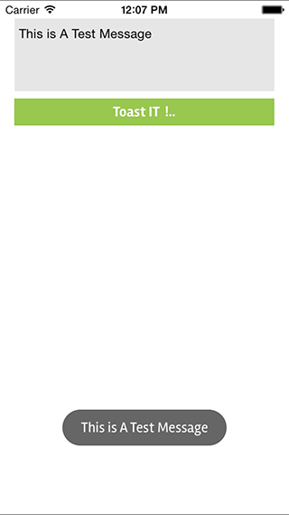
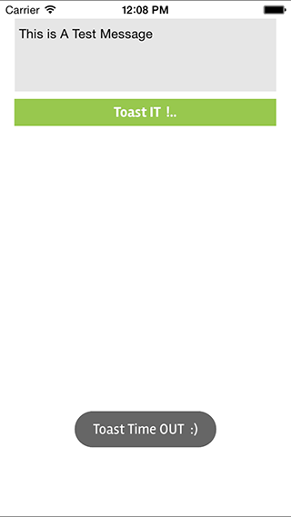

# NSToastView


[](http://cocoapods.org/pods/NSToastView)
[](http://cocoapods.org/pods/NSToastView)
[](http://cocoapods.org/pods/NSToastView)

## Usage

To run the example project, clone the repo, and run `pod install` from the Example directory first.

The class is Designed for Show Toast in iOS App  similar To the Android Toast.

## Requirements

iOS 6.0

## Installation

NSToastView is available through [CocoaPods](http://cocoapods.org). To install
it, simply add the following line to your Podfile:

## Example Use:
 ```

[NSToastView nsShowToast:@"This is a test Toast" duration:4.0f completion: ^{
        [NSToastView nsShowToast:@"" delay:0.5f];
}];

```
##POD

```ruby
pod "NSToastView"
```

## Screenshots



## Author

rahul-apple, rahulthazhuthala@gmail.com
- [Facebook][] Rahul Ramachandra
- [Google][] Rahul Ramachandra

[Google]:https://plus.google.com/+RahulR-apple
[Facebook]:https://www.facebook.com/hijaz3710

## License

NSToastView is available under the MIT license. See the LICENSE file for more info.
